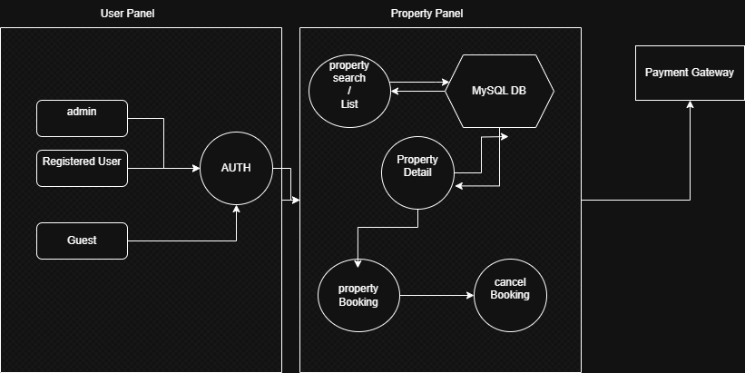

# ✅What is Requirement Analysis?
It's a set of actions/steps to be made to have a successful application Development.
it's a phase in what is known as Software Development Life Cycle (SDLC).

# ✅Why is Requirement Analysis Important?

## involves:
* Understanding what the software should do

* Identifying functional and non-functional requirements

* Analyzing feasibility, constraints, and risks

* Ensuring requirements are complete, clear, and consistent

# Key Activities in Requirement Analysis.

 * **Requirement Gathering**
   - Engage with stakeholders to collect initial requirements.
   - Use various techniques like interviews, surveys, and workshops.
* **Requirement Elicitation**
  - Refine and elaborate on the gathered requirements.
  - Use techniques like brainstorming, focus groups, and prototyping.
* **Requirement Documentation**
  - Document the requirements in a detailed and structured format.
  - Use requirement specification documents, user stories, and use cases.
* **Requirement Analysis and Modeling**
  - Analyze and prioritize the requirements.
  - Create models to visualize and understand the requirements.
* **Requirement Validation**
  - Review and validate the requirements with stakeholders.
  - Define acceptance criteria and ensure traceability.

# Types of Requirements:
  * Functional Requirements: 
    - login system / User Registration. 
    - report generation
  * Non-functional Requirements:
    - performance / page loading speed
    - security / user auth

# Use Case Diagrams:
  it shows how different users (actors) interact with the system to achieve specific goals (use cases).
  
* **Benefits of Use Case Diagrams:**
  - Provide a clear visual representation of system functionalities.
  - Help in identifying and organizing system requirements.
  - Facilitate communication among stakeholders and development team.

 

# Acceptance Criteria:
 Acceptance criteria are conditions that a feature must meet to be accepted by the stakeholders, It Must Be SMART(specific, Measurable, Achievable, Relevant, Time-bound).

* **Benefits of Acceptance Criteria:**

  - Ensure all parties have a clear understanding of feature requirements.
  - Provide a basis for testing and validation.
  - Help in maintaining quality and meeting user expectations.

## **acceptance criteria - Checkout Process:**

1. **Scenario**: Successful Checkout
   - Given the user has selected a listing and provided valid personal and payment details  
   - When the user clicks the “Confirm Booking” button  
   - Then the system should create a booking and show a confirmation message

2. **Scenario**: Payment Fails
   - Given the user has selected a listing  
   - When the payment is declined  
   - Then the system should display an error message and prompt for a different payment method

3. **Scenario**: Checkout as Guest
   - Given the user is not logged in  
   - When the user provides valid guest details and payment  
   - Then the system should allow booking without requiring registration

4. **Scenario**: Invalid Details
   - Given the user enters incomplete or invalid personal or payment information  
   - When the user tries to proceed  
   - Then the system should highlight errors and prevent checkout
